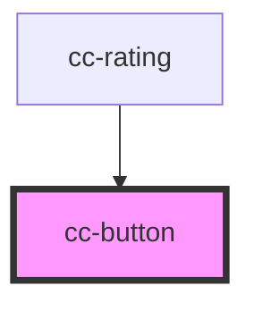

# cc-button

<!-- Auto Generated Below -->

## Properties

| Property  | Attribute | Description | Type      | Default        |
| --------- | --------- | ----------- | --------- | -------------- |
| `loading` | `loading` |             | `boolean` | `undefined`    |
| `primary` | `primary` |             | `boolean` | `undefined`    |
| `value`   | `value`   |             | `string`  | `'Abschicken'` |

## Dependencies

### Used by

 - [cc-rating](../cc-rating)

### Graph

----------------------------------------------

*Built with [StencilJS](https://stenciljs.com/)*
