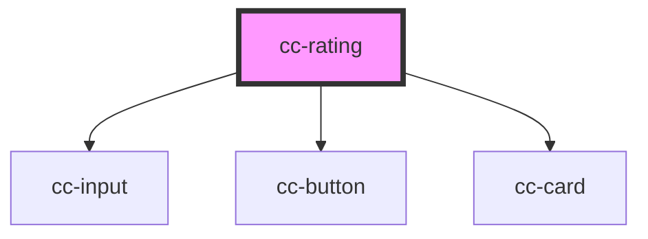

# cc-rating

<!-- Auto Generated Below -->

## Properties

| Property | Attribute | Description | Type     | Default     |
| -------- | --------- | ----------- | -------- | ----------- |
| `event`  | `event`   |             | `string` | `undefined` |

## Dependencies

### Depends on

- [cc-input](../cc-input)
- [cc-button](../cc-button)
- [cc-card](../cc-card)

### Graph

----------------------------------------------

*Built with [StencilJS](https://stenciljs.com/)*
